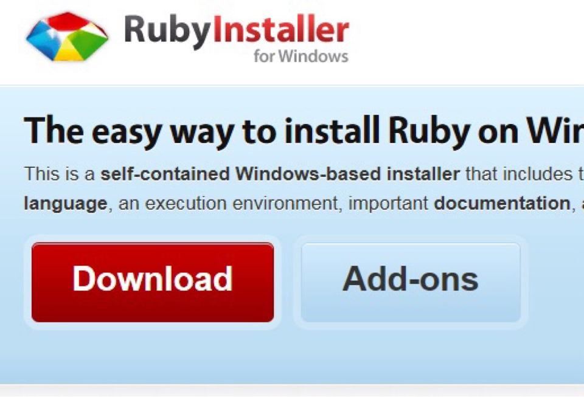
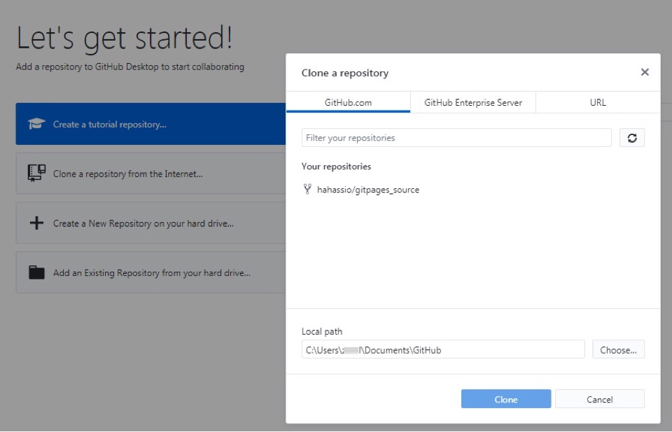
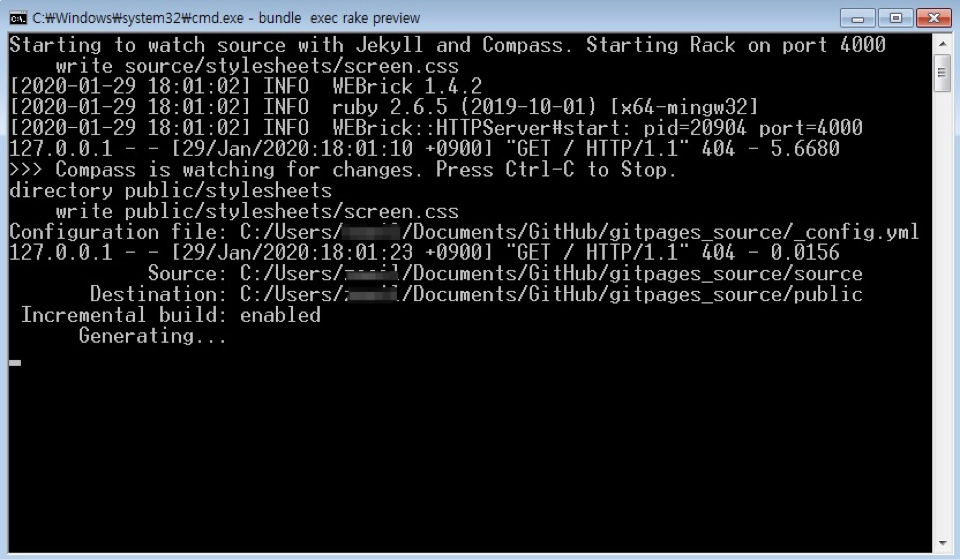

### Jekyll로 편집하기

다량 번역하는 경우 hakorea/gitpages_source 를 fork해서 본인의 깃허브 저장소에 먼저 복제를 해두시고요.
https://github.com/HAKorea/gitpages_source

이후 jekyll이란 정적 블로깅 도구를 설치해야 하는데 이게 루비라는 프로그램으로 동작합니다. 따라서...

https://rubyinstaller.org/downloads/

루비 설치를 위해 위 사이트로 이동합니다.

다운로드를 눌러 본인에게 맞는 루비를 설치합니다. 저는 추천하는 2.6.5-1버전를 설치했네요.

설치가 완료되면 cmd 창이 위와같이 뜹니다. 엔터를 눌러 추가 설치를 기다리시면 됩니다.

설치가 끝나면 다시 위와 같이 엔터키를 누르기를 기다리는 화면이 다시 나오는데 그냥 엔터를 누르면 설치가 완료 되네요.
루비 설치가 끝나면 cmd 창 띄우고

ruby -version

을 입력하면 루비 버전 나오면 제대로 설치된 것입니다.

이 다음엔 jekyll을 설치해야 합니다.

gem install jekyll bundle bundler

하면 지킬과 관련된 파일들을 설치합니나. 뭔가 많이 설치합니다. 시간이 좀 걸리네요

다음으로 github desktop을 설치합니다.

github desktop 설치가 끝나면 로그인 하시고 clone repository를 선택해서 github에서 fork 한 소스를 내려받습니다.

cmd 프로그램으로 내려받은 로컬 경로로 이동
cd /Users/내윈도우아이디/Documents/GitHub/gitpages_source

한 다음

bundle

명령을 실행해서 의존성 파일을 설치합니다. 또 뭔가를 마구 설치합니다.

이제 끝났어요. 지킬을 실행하면 됩니다.
bundle exec rake preview

이 명령을 치면 웹사이트 소스로부터 html파일을 생성합니다. 처음 실행할땐 시간이 1~2분 걸립니다.

웹브라우저로 http://127.0.0.1:4000으로 접속하면 https://hakorea.github.io 와 동일한 페이지가 보입니다. 이것은 여러분 컴퓨터에서 만든 것이구요.

앞서 bundle명령을 종료하는 것은 ctrl+c 입니다. 그러면 웹브라우저로 보는 페이지도 안보입니다. 로컬 웹서버가 종료된 것이죠. 보고싶을땐 다시 bundle exec rake preview 명령을 실행하면 수정한 파일만 다시 만들고 웹브라우저로 볼 수 있습니다. 이 과정이 지킬 프로그램으로 마크다운 문서를 정적인 html 웹페이지로 만드는 것입니다.

소스코드는 sources 폴더에 들어 있습니다. atom 편집기를 설치하시면 markdown 문서를 손쉽게 편집할 수 있습니다. 아니면 bundle exec rake preview 명령을 실행해놓고 markdown 문서를 텍스트 에디터로 편집하면 실시간으로 페이지를 변환하고 웹브라우저로 http://127.0.0.1:4000 에 접속해서 변경된걸 리프레시해서 보면 됩니다. 이렇게 하면 깃허브 편집을 눌러 웹에서 고치는 것보다 편리합니다.

번역을 완료한 문서는 깃허브 데스크탑에서 원격저장소로 commit하시구요. push 하시면 나의 깃허브 fork에 소스가 올라갑니다. 깃허브 사이트에서 pull request 하시면 hakorea에 소스 수정 요청(merge)을 하게되고 검토를 거쳐 반영합니다.

주의: 절대로 .gitignore 파일을 수정하지 마세요. 깃에 올리는 파일에 제한을 둔거라... 잘못된 파일을 올리시고 풀리퀘스트하시면... 파일 제어가 안되서 리젝하는 상황이 생길 수도 있습니다...
